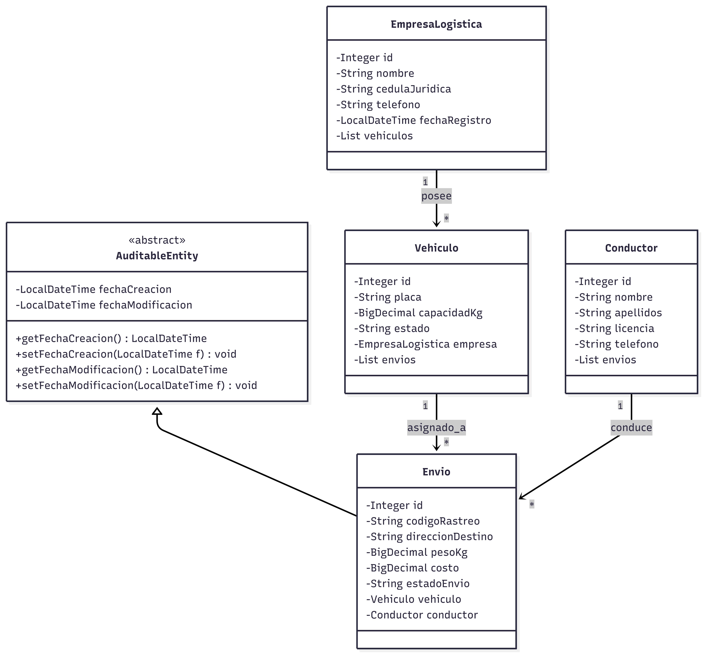

**UNIVERSIDAD DE COSTA RICA**  
**SEDE DEL ATLÁNTICO - RECINTO PARAÍSO**  
**CARRERA DE INFORMÁTICA EMPRESARIAL**  
**CURSO:** IF0009 - Desarrollo de Software IV  
**PROFESOR:** Mag. Jonathan Granados C.  
**SEMESTRE:** II-2026  

---

# Laboratorio 5: Plataforma Full-Stack de Logística y Monitoreo de Envíos Express ("ExpresoFast")

## Metadatos

*   **Tiempo Estimado:** 6 horas (trabajo autónomo individual o en parejas)
*   **Herramientas Requeridas:**
    *   Java 21 (o versión local instalada) con Maven.
    *   Spring Boot 3.x con Spring Data JPA, Hibernate y Web.
    *   Microsoft SQL Server Developer Edition y SSMS.
    *   VS Code / Navegador Web moderno con herramientas de desarrollador.
*   **Metas de Aprendizaje:**
    1.  Modelar una arquitectura multicapa desacoplada orientada al dominio logístico respetando la integridad referencial objeto-relacional.
    2.  Implementar auditoría de entidades JPA y optimización de consultas JPQL con `JOIN FETCH` para evitar fallos N+1 SELECT.
    3.  Exponer y asegurar controladores RESTful habilitando el intercambio de recursos de origen cruzado (CORS).
    4.  Construir un tablero web de control interactivo utilizando HTML5 semántico, CSS Grid, Flexbox y peticiones asíncronas con Fetch API.

---

## Introducción y Caso de Estudio

La empresa de logística nacional **ExpresoFast** requiere una plataforma web integral para administrar su flota de vehículos de carga y el rastreo de envíos express a nivel nacional.

Como Ingeniero(a) de Software Full-Stack, usted debe diseñar el sistema desde cero. El backend debe desarrollarse en Java con **Spring Boot**, **Spring Data JPA** e **Hibernate** conectándose a su servidor de base de datos **SQL Server**. El frontend debe consistir en un portal web responsivo construido con **HTML5 semántico**, estilos en **CSS3** (Flexbox y Grid) y consumo asíncrono en JavaScript mediante **Fetch API**.

---

## Estructura Relacional de Base de Datos

Su base de datos debe llamarse `ExpresoFast[Carné]_II2026`. Defina la estructura física en SQL Server siguiendo la especificación relacional detallada a continuación (máximo 4 tablas). **Nota:** No se proveen scripts SQL; usted debe crear el DDL correspondiente en SSMS.

### 1. Tabla `EmpresaLogistica`
Almacena las empresas propietarias de las flotas de transporte.

| Campo | Tipo de Dato | Restricciones / Descripción |
| :--- | :--- | :--- |
| `empresa_id` | INT | Clave Primaria, Identity (Autoincremental). |
| `nombre` | VARCHAR(100) | No Nulo, Único. |
| `cedula_juridica` | VARCHAR(20) | No Nulo, Único. |
| `telefono` | VARCHAR(20) | No Nulo. |
| `fecha_registro` | DATETIME | No Nulo. |

### 2. Tabla `Vehiculo`
Representa los vehículos asignados al transporte de paquetes.

| Campo | Tipo de Dato | Restricciones / Descripción |
| :--- | :--- | :--- |
| `vehiculo_id` | INT | Clave Primaria, Identity (Autoincremental). |
| `placa` | VARCHAR(15) | No Nulo, Único. |
| `capacidad_kg` | DECIMAL(10,2) | No Nulo. |
| `estado` | VARCHAR(20) | No Nulo (`'DISPONIBLE'`, `'EN_RUTA'`, `'MANTENIMIENTO'`). |
| `empresa_id` | INT | Clave Foránea referenciando a `EmpresaLogistica(empresa_id)`. |

### 3. Tabla `Conductor`
Registra al personal autorizado para el manejo de unidades.

| Campo | Tipo de Dato | Restricciones / Descripción |
| :--- | :--- | :--- |
| `conductor_id` | INT | Clave Primaria, Identity (Autoincremental). |
| `nombre` | VARCHAR(50) | No Nulo. |
| `apellidos` | VARCHAR(50) | No Nulo. |
| `licencia` | VARCHAR(20) | No Nulo, Único. |
| `telefono` | VARCHAR(20) | No Nulo. |

### 4. Tabla `Envio`
Registra los envíos de paquetes express asignados a un vehículo y conductor.

| Campo | Tipo de Dato | Restricciones / Descripción |
| :--- | :--- | :--- |
| `envio_id` | INT | Clave Primaria, Identity (Autoincremental). |
| `codigo_rastreo` | VARCHAR(30) | No Nulo, Único. |
| `direccion_destino` | VARCHAR(200) | No Nulo. |
| `peso_kg` | DECIMAL(10,2) | No Nulo. |
| `costo` | DECIMAL(10,2) | No Nulo. |
| `estado_envio` | VARCHAR(20) | No Nulo (`'PENDIENTE'`, `'EN_TRANSITO'`, `'ENTREGADO'`, `'CANCELADO'`). |
| `vehiculo_id` | INT | Clave Foránea referenciando a `Vehiculo(vehiculo_id)`. |
| `conductor_id` | INT | Clave Foránea referenciando a `Conductor(conductor_id)`. |
| `fecha_creacion` | DATETIME | Nulo (Mapeado mediante auditoría automatizada JPA). |
| `fecha_modificacion` | DATETIME | Nulo (Mapeado mediante auditoría automatizada JPA). |

---

## Diagrama de Clases UML

A continuación se presenta el diseño del modelo de dominio de clases que debe implementar en Java bajo las convenciones de Spring Data JPA e Hibernate:



---

## Especificaciones del Backend (Spring Boot)

Organice su proyecto bajo la estructura multicapa mandatoria del curso: `cr.ac.ucr.paraiso.ie.carnet.expresofast.*` (reemplazando `carnet` por su carnet universitario):

### 1. Capa de Dominio (`domain`)

* Cree la superclase `AuditableEntity.java` anotada con `@MappedSuperclass` y `@EntityListeners(AuditingEntityListener.class)`.

* Mapee las clases `@Entity` correspondientes (`EmpresaLogistica`, `Vehiculo`, `Conductor`, `Envio`).

* Configure la anotación `@EnableJpaAuditing` en una clase de configuración dentro del paquete `config`.

### 2. Capa de Datos (`data`)

* Cree las interfaces que extiendan de `JpaRepository`.

* En `EnvioRepository.java`, defina una consulta JPQL con `JOIN FETCH` para recuperar los envíos conjuntamente con las entidades `Vehiculo`, `EmpresaLogistica` y `Conductor` en un único viaje a SQL Server (previniendo el fallo N+1 SELECT).

* Incluya un método con `@Modifying(clearAutomatically = true)` para actualizar de forma masiva el estado de los envíos asociados a un vehículo específico.

### 3. Capa de Negocio (`business`)

* Cree servicios anotados con `@Service` e inyección de dependencias por constructor.

* Implemente reglas de validación (ej: validar que el peso del envío no supere la capacidad máxima del vehículo asignado).

* Configure la demarcación transaccional mediante la anotación `@Transactional`.

### 4. Capa de Controladores (`controller`)

* Cree controladores RESTful anotados con `@RestController`, `@RequestMapping("/api/envios")` y `@CrossOrigin(origins = "*")`.

* Exponga el endpoint `GET /api/envios/optimizados` para retornar la lista de envíos cargados con `JOIN FETCH`.

* Exponga el endpoint `POST /api/envios` para registrar un nuevo envío express.

* Exponga el endpoint `PATCH /api/envios/{id}/estado` para actualizar el estado del envío aprovechando *Dirty Checking*.

---

## Especificaciones del Frontend (HTML5 y CSS3)

Cree la carpeta `frontend/` en la raíz del entregable para construir el portal de monitoreo:

### 1. Estructura HTML5 Semántica (`index.html`)

* Construya una interfaz limpia utilizando etiquetas semánticas (`<header>`, `<nav>`, `<main>`, `<section>`, `<article>`, `<form>`).

* Incluya un formulario estructurado para registrar nuevos envíos (código de rastreo, dirección destino, peso, costo, ID de vehículo e ID de conductor).

* Incluya un panel lateral con filtros interactivos de estado (`TODOS`, `PENDIENTE`, `EN_TRANSITO`, `ENTREGADO`).

### 2. Diseño CSS3 Moderno (`styles.css`)

* Utilice variables CSS (`:root`) para manejar la paleta cromática corporativa.

* Diseñe la barra superior utilizando **Flexbox**.

* Diseñe el tablero de control principal utilizando **CSS Grid Layout** responsivo (`repeat(auto-fit, minmax(280px, 1fr))`).

* Implemente distintivos visuales (píldoras `.pill-status`) para representar el estado de cada envío:
  - `ENTREGADO`: Verde `#16a34a`.
  - `EN_TRANSITO`: Azul `#2563eb`.
  - `PENDIENTE`: Amarillo `#d97706`.
  - `CANCELADO`: Rojo `#dc2626`.

### 3. Consumo Asíncrono (`app.js`)

* Realice peticiones asíncronas HTTP mediante `fetch()` para consumir la API de Spring Boot.

* Implemente el envío de datos mediante `POST` enviando objetos JSON estructurados con cabeceras `'Content-Type': 'application/json'`.

* Incorpore botones de acción rápida en cada tarjeta ("Marcar en Tránsito", "Marcar Entregado") invocando el endpoint `PATCH`.

---

## Pistas y Ayudas de Desarrollo

### Pista 1: Mapeo de Objetos Anidados en JSON (Fetch POST)
Al enviar un nuevo envío desde Javascript hacia Spring Boot, recuerde estructurar los objetos de relación con sus IDs correspondientes:
```javascript
const payload = {
    codigoRastreo: "EXP-9901",
    direccionDestino: "Paraiso, Cartago",
    pesoKg: 12.5,
    costo: 3500.00,
    vehiculo: { id: parseInt(document.getElementById('vehiculoId').value) },
    conductor: { id: parseInt(document.getElementById('conductorId').value) }
};
```

### Pista 2: Evitar Referencias Circulares JSON
Utilice `@JsonIgnore` o instancie DTOs en las relaciones bidireccionales de las entidades JPA para prevenir excepciones de serialización infinita (`JsonMappingException`) al retornar respuestas JSON desde la API REST.

---

## Rúbrica de Evaluación

La evaluación del **Laboratorio 5** se ponderará sobre los siguientes criterios:

| Criterio de Evaluación | Porcentaje | Descripción Detallada |
| :--- | :--- | :--- |
| **Modelado de Persistencia y Auditoría** | **20%** | Creación física de tablas en SQL Server y entidades JPA en Java con auditoría automática (`@CreatedDate`, `@LastModifiedDate`). |
| **Arquitectura de Capas y Transacciones** | **20%** | Separación limpia (`domain`, `data`, `business`, `controller`), inyección por constructor y uso de `@Transactional`. |
| **Optimización JPQL (JOIN FETCH) y CORS** | **20%** | Consulta JPQL para eliminar el fallo N+1 SELECT, anotación `@CrossOrigin` y endpoints REST funcionales. |
| **Interfaz HTML5 Semántica y Accesible** | **15%** | Estructura web correcta con etiquetas semánticas, formularios estructurados y controles accesibles. |
| **Estilos CSS3 (Flexbox & CSS Grid Layout)** | **10%** | Maquetación responsiva con CSS Grid, Flexbox, variables CSS y píldoras visuales de estado. |
| **Integración Asíncrona con Fetch API** | **15%** | Consumo correcto de endpoints `GET`, `POST` y `PATCH` actualizando el DOM en tiempo real sin recargar la página. |
| **Total** | **100%** | **Nota Final del Laboratorio 5** |
