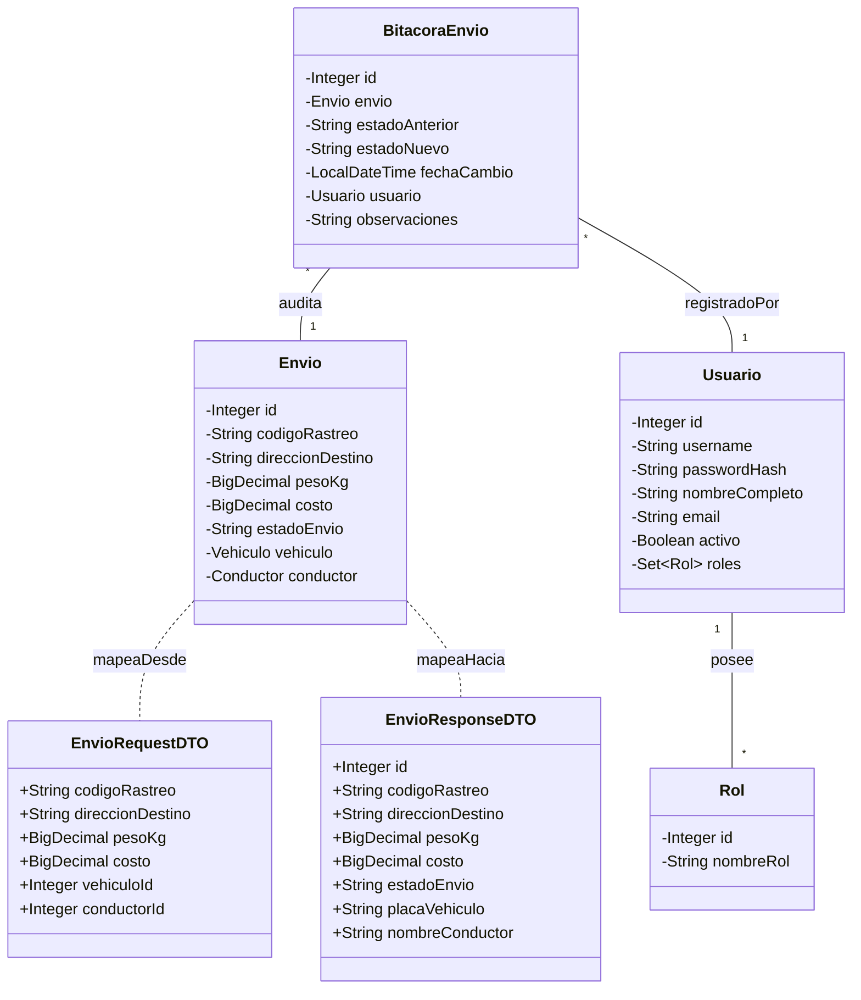

**UNIVERSIDAD DE COSTA RICA**  
**SEDE DEL ATLÁNTICO - RECINTO PARAÍSO**  
**CARRERA DE INFORMÁTICA EMPRESARIAL**  
**CURSO:** IF0009 - Desarrollo de Software IV  
**PROFESOR:** Mag. Jonathan Granados C.  
**SEMESTRE:** II-2026  

---

# Laboratorio 6: Plataforma Full-Stack de Logística "ExpresoFast" (Parte II: Seguridad JWT, Control de Acceso RBAC, DTOs, Bitácora de Auditoría y Entrega en GitHub)

## Metadatos

*   **Tiempo Estimado:** 6 horas (trabajo autónomo individual o en parejas)
*   **Herramientas Requeridas:**
    *   Java 21 (o versión local instalada) con Maven.
    *   Spring Boot 3.x con Spring Data JPA, Spring Security y Hibernate.
    *   Librería JWT (jjwt 0.12.x o com.auth0 java-jwt).
    *   Microsoft SQL Server Developer Edition y SSMS.
    *   Visual Studio Code / Navegador Web moderno con DevTools.
    *   Git y Cuenta activa de GitHub.
*   **Metas de Aprendizaje:**
    1.  Asegurar una API RESTful mediante autenticación basada en tokens JWT (JSON Web Tokens) y control de acceso basado en roles (RBAC).
    2.  Implementar la capa de Transferencia de Datos (DTOs) y validación estricta de datos de entrada (`jakarta.validation`) para mitigar vulnerabilidades de seguridad (OWASP Top 10).
    3.  Construir un manejador global de excepciones con `@RestControllerAdvice` para estandarizar las respuestas HTTP de error sin exponer detalles sensibles del servidor.
    4.  Extender la base de datos relacional y el frontend para gestionar bitácoras de auditoría histórica e integrar una experiencia de usuario autenticada responsiva.
    5.  Publicar y estructurar el proyecto en un repositorio de GitHub bajo buenas prácticas de control de versiones y entregarlo formalmente en Mediación Virtual.

---

## Introducción y Caso de Estudio (Segunda Parte)

En la primera etapa de la plataforma **ExpresoFast** (Laboratorio 5), usted diseñó las entidades fundamentales del dominio logístico (`EmpresaLogistica`, `Vehiculo`, `Conductor` y `Envio`), optimizó las consultas JPQL con `JOIN FETCH` y creó un tablero web interactivo.

Para esta **Parte II**, la dirección de TI de ExpresoFast exige elevar los estándares de seguridad y trazabilidad de la plataforma antes de su despliegue operativo. En esta entrega, usted debe:

1.  **Asegurar los Endpoints de la API REST:** Restringir el acceso mediante tokens **JWT** y roles de usuario (`ROLE_ADMIN`, `ROLE_OPERADOR`, `ROLE_CONDUCTOR`).
2.  **Desacoplar la Capa de Presentación del Dominio (DTOs):** Implementar objetos DTO con validaciones estrictas (`@NotBlank`, `@Positive`, `@Pattern`) para prevenir datos corruptos o inyecciones de código.
3.  **Auditoría y Bitácora Transaccional:** Registrar automáticamente cada cambio de estado de un envío en una nueva tabla de bitácora (`BitacoraEnvio`), incluyendo usuario actuante, fecha/hora y justificación.
4.  **Frontend Autenticado y Adaptativo:** Agregar un módulo de inicio de sesión, almacenar el token JWT de forma segura en el cliente, adjuntar el encabezado `Authorization: Bearer <token>` en cada solicitud asíncrona `fetch()` y renderizar las opciones de interfaz dinámicamente según el rol del usuario autenticado.
5.  **Control de Versiones y Entrega:** Versionar el proyecto en **GitHub** con commits semánticos y adjuntar el enlace oficial en la plataforma **Mediación Virtual**.

---

## Estructura Relacional de Base de Datos Extendida

Mantenga la base de datos de la primera parte (`ExpresoFast[Carné]_II2026`) y cree las siguientes tres tablas adicionales para la gestión de usuarios, roles y bitácoras de auditoría:

### 1. Tabla `Usuario`
Almacena las credenciales y la información de los usuarios del sistema.

| Campo | Tipo de Dato | Restricciones / Descripción |
| :--- | :--- | :--- |
| `usuario_id` | INT | Clave Primaria, Identity (Autoincremental). |
| `username` | VARCHAR(50) | No Nulo, Único. |
| `password_hash` | VARCHAR(255) | No Nulo (Contraseña encriptada con BCrypt). |
| `nombre_completo` | VARCHAR(100) | No Nulo. |
| `email` | VARCHAR(100) | No Nulo, Único. |
| `activo` | BIT | No Nulo (1: Activo, 0: Inactivo). |

### 2. Tabla `Rol`
Define los roles del sistema para el control de acceso (RBAC).

| Campo | Tipo de Dato | Restricciones / Descripción |
| :--- | :--- | :--- |
| `rol_id` | INT | Clave Primaria, Identity (Autoincremental). |
| `nombre_rol` | VARCHAR(30) | No Nulo, Único (`'ROLE_ADMIN'`, `'ROLE_OPERADOR'`, `'ROLE_CONDUCTOR'`). |

### 3. Tabla `UsuarioRol` (Tabla Intermedia)
Establece la relación de muchos a muchos entre usuarios y roles.

| Campo | Tipo de Dato | Restricciones / Descripción |
| :--- | :--- | :--- |
| `usuario_id` | INT | Clave Foránea referenciando a `Usuario(usuario_id)`. |
| `rol_id` | INT | Clave Foránea referenciando a `Rol(rol_id)`. |
| | | **Clave Primaria Compuesta (`usuario_id`, `rol_id`)**. |

### 4. Tabla `BitacoraEnvio`
Registra el historial de auditoría de los cambios de estado de cada envío.

| Campo | Tipo de Dato | Restricciones / Descripción |
| :--- | :--- | :--- |
| `bitacora_id` | INT | Clave Primaria, Identity (Autoincremental). |
| `envio_id` | INT | Clave Foránea referenciando a `Envio(envio_id)`. |
| `estado_anterior` | VARCHAR(20) | No Nulo. |
| `estado_nuevo` | VARCHAR(20) | No Nulo. |
| `fecha_cambio` | DATETIME | No Nulo. |
| `usuario_id` | INT | Clave Foránea referenciando a `Usuario(usuario_id)`. |
| `observaciones` | VARCHAR(250) | Nulo. |

---

## Matriz de Permisos y Control de Acceso por Rol (RBAC)

La API REST debe validar que cada solicitud HTTP cuente con un token JWT válido y que el usuario autenticado posea los permisos indicados en la siguiente matriz:

| Endpoint REST | Método | Roles Permitidos | Descripción Funcional |
| :--- | :--- | :--- | :--- |
| `/api/auth/login` | `POST` | Público | Autenticación y generación del Token JWT. |
| `/api/envios/optimizados` | `GET` | `ADMIN`, `OPERADOR`, `CONDUCTOR` | Consulta general del tablero de envíos. |
| `/api/envios` | `POST` | `ADMIN`, `OPERADOR` | Registro de un nuevo envío express. |
| `/api/envios/{id}/estado` | `PATCH` | `ADMIN`, `CONDUCTOR` | Cambio de estado de un envío (genera bitácora). |
| `/api/envios/{id}/bitacora`| `GET` | `ADMIN`, `OPERADOR` | Consulta de la bitácora de auditoría de un envío. |
| `/api/vehiculos/**` | `ALL` | `ADMIN` | Gestión completa de la flota de vehículos. |

---

## Diagrama de Clases UML Extendido

El siguiente diagrama detalla la arquitectura de clases del dominio y la relación con los DTOs y la seguridad:



---

## Especificaciones del Backend (Spring Boot & Security)

Organice los nuevos componentes respetando la arquitectura por capas dentro del paquete `cr.ac.ucr.paraiso.ie.carnet.expresofast.*`:

### 1. Capa de Dominio y DTOs (`domain` / `dto`)

*   Mapee las entidades JPA `@Entity` para `Usuario`, `Rol` y `BitacoraEnvio`.

*   Cree el paquete `dto` e implemente las clases de transferencia de datos:
    *   `AuthRequestDTO` (`username`, `password`).
    *   `AuthResponseDTO` (`token`, `username`, `roles`, `expirationTime`).
    *   `EnvioRequestDTO`: Incluya anotaciones de validación `jakarta.validation`:
        *   `@NotBlank(message = "El código de rastreo es obligatorio")`
        *   `@Pattern(regexp = "^EXP-\\d{4}$", message = "Formato inválido. Ejemplo: EXP-1234")`
        *   `@Positive(message = "El peso debe ser mayor a cero")`
    *   `EnvioResponseDTO`: DTO plano para enviar al cliente evitando ciclos de serialización JSON.
    *   `CambioEstadoDTO` (`nuevoEstado`, `observaciones`).
    *   `BitacoraResponseDTO` (`id`, `estadoAnterior`, `estadoNuevo`, `fechaCambio`, `usuario`, `observaciones`).

### 2. Configuración de Seguridad (`security` / `config`)

*   Implemente `JwtTokenProvider.java` para generar, firmar y validar tokens JWT utilizando una clave secreta configurada en `application.properties`.

*   Implemente `JwtAuthenticationFilter.java` que extienda de `OncePerRequestFilter` para interceptar cada petición, extraer el token del encabezado `Authorization: Bearer`, validar su firma y cargar el contexto de seguridad en `SecurityContextHolder`.

*   Configure `SecurityConfig.java` anotado con `@Configuration` y `@EnableWebSecurity`:
    *   Defina el bean `SecurityFilterChain` con política de sesión **Stateless** (`SessionCreationPolicy.STATELESS`).
    *   Habilite el encriptador de contraseñas `BCryptPasswordEncoder`.
    *   Configure las reglas de autorización por endpoint según la Matriz RBAC.
    *   Habilite la configuración de CORS para permitir peticiones desde el cliente web.

### 3. Capa de Negocio (`business`)

*   En `EnvioService.java`, actualice el método de cambio de estado para que:
    1.  Verifique el estado actual del envío.
    2.  Actualice el nuevo estado en la entidad `Envio`.
    3.  Obtenga el usuario autenticado del `SecurityContextHolder`.
    4.  Cree y guarde automáticamente un registro en `BitacoraEnvioRepository`.

*   Cree `AuthService.java` para autenticar usuarios mediante `AuthenticationManager` y retornar el DTO con el Token JWT.

### 4. Manejo Global de Excepciones (`exception`)

*   Cree la clase `GlobalExceptionHandler.java` anotada con `@RestControllerAdvice`.

*   Implemente métodos anotados con `@ExceptionHandler` para capturar:
    *   `MethodArgumentNotValidException`: Retornar un `BAD_REQUEST` (400) con la lista detallada de errores de validación por campo.
    *   `ResourceNotFoundException`: Retornar un `NOT_FOUND` (404) con un mensaje amigable.
    *   `BadCredentialsException` / `AccessDeniedException`: Retornar `UNAUTHORIZED` (401) o `FORBIDDEN` (403).
    *   `Exception` (Genérico): Capturar cualquier error inesperado y devolver `INTERNAL_SERVER_ERROR` (500) sin revelar el stacktrace.

---

## Especificaciones del Frontend (HTML5, CSS3 y JS Asíncrono)

Extienda el portal web desarrollado en el Laboratorio 5 dentro de la carpeta `frontend/`:

### 1. Módulo de Autenticación (`login.html` / Modal de Inicio de Sesión)

*   Construya una interfaz de inicio de sesión intuitiva con campos para usuario y contraseña.

*   Al enviar el formulario, realice una petición `POST /api/auth/login` con Fetch API.

*   Si la autenticación es exitosa, almacene el token JWT devuelto en `localStorage` junto con el nombre de usuario y los roles.

### 2. Tablero Principal Protegido (`index.html` & `app.js`)

*   **Intercepción de Peticiones:** Configure una función helper para peticiones `fetchWithAuth(url, options)` que agregue automáticamente el encabezado:

    ```javascript
    headers: {
        'Content-Type': 'application/json',
        'Authorization': `Bearer ${localStorage.getItem('jwt_token')}`
    }
    ```

*   **Manejo de Expiración de Sesión:** Si la API responde con un código `401 Unauthorized` o `403 Forbidden`, elimine el token de `localStorage` y redirija automáticamente al usuario a la pantalla de inicio de sesión.

*   **Renderizado Condicional por Rol:**
    *   Si el usuario tiene el rol `ROLE_CONDUCTOR`, la interfaz debe ocultar el formulario de creación de nuevos envíos y la pestaña de gestión de flotas.
    *   Si el usuario tiene el rol `ROLE_ADMIN` u `ROLE_OPERADOR`, muestre el botón "Ver Bitácora" en cada tarjeta de envío.

### 3. Modal de Bitácora de Auditoría Histórica

*   Al presionar "Ver Bitácora" en un envío, realice una petición `GET /api/envios/{id}/bitacora`.

*   Despliegue un modal emergente (diseñado con CSS Flexbox y posición fija) que presente el historial de cambios (Estado anterior $\rightarrow$ Estado nuevo, Fecha/Hora, Usuario que modificó y Observaciones).

---

## Instrucción de Depuración y Diagnóstico del Error Común

En el desarrollo de la seguridad con Spring Boot y JPA, un fallo común ocurre cuando las respuestas de error devuelven bucles infinitos o el filtro de seguridad bloquea peticiones válidas de pre-vuelo (CORS `OPTIONS`).

### Error Común: Bloqueo de Peticiones CORS OPTIONS en Pre-vuelo con Spring Security

Al integrar el frontend desacoplado con la API protegida por JWT, el navegador web envía automáticamente una petición HTTP `OPTIONS` previa a cualquier solicitud `POST`, `PATCH` o `DELETE`. Si Spring Security no está configurado para permitir las solicitudes `OPTIONS` sin autenticación, el navegador bloqueará la llamada con un error de CORS.

*   **Síntoma en Consola del Navegador:**

    ```text
    Access to fetch at 'http://localhost:8080/api/envios' from 
    origin 'http://127.0.0.1:5500' has been blocked by CORS policy: 
    Response to preflight request doesn't pass access control check: 
    It does not have HTTP ok status.
    ```

- [ ] **Paso 1:** Verifique en las herramientas de desarrollador (Pestaña *Network*) la solicitud `OPTIONS` enviada por el navegador.

- [ ] **Paso 2:** Inspeccione si la respuesta del servidor devuelve un código HTTP `401` o `403`.

- [ ] **Paso 3:** Abra la clase de configuración de seguridad `SecurityConfig.java` y asegúrese de permitir explícitamente el método HTTP `OPTIONS` antes de las rutas protegidas:

    ```java
    @Bean
    public SecurityFilterChain securityFilterChain(HttpSecurity http) 
            throws Exception {
        http
            .cors(Customizer.withDefaults())
            .csrf(csrf -> csrf.disable())
            .authorizeHttpRequests(auth -> auth
                .requestMatchers(HttpMethod.OPTIONS, "/**").permitAll()
                .requestMatchers("/api/auth/**").permitAll()
                .anyRequest().authenticated()
            )
            .sessionManagement(sess -> sess
                .sessionCreationPolicy(SessionCreationPolicy.STATELESS)
            )
            .addFilterBefore(jwtAuthenticationFilter, 
                UsernamePasswordAuthenticationFilter.class);
        return http.build();
    }
    ```

- [ ] **Paso 4:** Reinicie el servidor Spring Boot, limpie la caché del navegador y confirme que las solicitudes `OPTIONS` retornen un código `200 OK` con los encabezados `Access-Control-Allow-Origin`.

---

## Reto Autónomo de Ampliación

Extienda la funcionalidad del sistema implementando las siguientes especificaciones sin guía paso a paso:

1.  **Bloqueo de Cambio de Estado Inválido (Regla de Negocio):**
    *   En `EnvioService.java`, valide la secuencia lógica de los estados de un envío:
        *   Un envío en estado `ENTREGADO` o `CANCELADO` **no puede** volver a pasar a `PENDIENTE` o `EN_TRANSITO`.
        *   Si se intenta realizar una transición inválida, lance una excepción de negocio `InvalidStateTransitionException` que sea capturada por `GlobalExceptionHandler` retornando un código `400 Bad Request` con el mensaje: *"Transición de estado no permitida para el envío [CÓDIGO]"*.

2.  **Filtro de Auditoría por Rango de Fechas en Frontend:**
    *   Incorpore en el modal de bitácora dos campos tipo `<input type="date">` para filtrar las entradas del historial entre una fecha inicial y una fecha final.

---

## Guía de Entrega y Control de Versiones en GitHub

El entregable del **Laboratorio 6** debe gestionarse formalmente en un repositorio de **GitHub** y su enlace oficial debe registrarse en **Mediación Virtual**.

### 1. Estructura Obligatoria del Repositorio de GitHub

El repositorio debe llamarse obligatoriamente `expresofast-lab6-[carnet]` (reemplazando `[carnet]` por su carnet universitario en minúsculas) y contener la siguiente estructura interna:

```text
expresofast-lab6-carnet/
├── backend/
│   ├── src/
│   ├── pom.xml
│   └── application.properties.template
├── database/
│   ├── 01_schema_lab5.sql
│   ├── 02_schema_lab6_extension.sql
│   └── 03_data_seeds.sql
├── frontend/
│   ├── index.html
│   ├── login.html
│   ├── styles.css
│   └── app.js
├── docs/
│   └── ExpresoFast_Postman_Collection.json
└── README.md
```

### 2. Requerimientos de Commits Semánticos en Git

Su historial de commits en Git será evaluado. Se requiere un mínimo de **8 commits** relevantes aplicando la convención de commits semánticos:
*   `feat: agregar entidad BitacoraEnvio y DTOs de auditoria`
*   `feat: implementar seguridad JWT y filtro de autenticacion`
*   `feat: crear controlador de autenticacion y servicio de login`
*   `fix: corregir politica de CORS para solicitudes pre-flight OPTIONS`
*   `docs: agregar coleccion de Postman y documentacion en README`

### 3. Archivo `README.md` Profesional

El archivo `README.md` en la raíz del repositorio debe incluir obligatoriamente:
1.  **Título y Carátula:** Nombre del curso, ciclo, laboratorio, nombre completo del estudiante y carnet.
2.  **Requisitos de Entorno:** Versiones de Java, Maven, SQL Server y navegador utilizado.
3.  **Guía de Configuración de Base de Datos:** Pasos para ejecutar los scripts SQL e insertar los usuarios iniciales con sus contraseñas encriptadas.
4.  **Usuarios de Prueba:** Tabla con las credenciales de prueba preconfiguradas para cada rol (ej: `admin/admin123` $\rightarrow$ `ROLE_ADMIN`, `conductor1/cond123` $\rightarrow$ `ROLE_CONDUCTOR`).
5.  **Instrucciones de Ejecución:** Comandos para compilar y levantar el backend (`mvn spring-boot:run`) y el frontend.

### 4. Entrega Final en Mediación Virtual

*   Acceda al entorno oficial de **Mediación Virtual** del curso IF0009.
*   Ubique la tarea habilitada como **"Entrega de Laboratorio 6 - ExpresoFast Parte II"**.
*   Pegue únicamente la **URL pública/privada de su repositorio de GitHub** (ejemplo: `https://github.com/usuario/expresofast-lab6-c12345`).
*   **Nota:** Si el repositorio es privado, asegúrese de agregar como colaborador al usuario de GitHub del docente (`jgranadosc`).

---

## Pistas y Ayudas de Desarrollo

### Pista 1: Insertar Usuarios Iniciales con BCrypt en SQL
Al insertar los usuarios de prueba directamente en SQL Server, asegúrese de guardar las contraseñas procesadas con BCrypt. Ejemplo de script de semillas:

```sql
-- Contraseña plana para todos los usuarios: 'Password123!'
INSERT INTO Usuario (username, password_hash, nombre_completo, email, activo) 
VALUES ('admin', 
        '$2a$10$e0MYzXyjpJS7Pd0RVvHwHe1Wn5cGBwA/7XgOymx1i86Kx5w5zK7y6', 
        'Carlos Alvarado', 'admin@expresofast.cr', 1);

INSERT INTO Rol (nombre_rol) 
VALUES ('ROLE_ADMIN'), ('ROLE_OPERADOR'), ('ROLE_CONDUCTOR');

INSERT INTO UsuarioRol (usuario_id, rol_id) VALUES (1, 1);
```

### Pista 2: Extracción del Usuario Autenticado en el Servicio
Para obtener los datos del usuario que realiza la transacción dentro de `EnvioService.java`:

```java
Authentication auth = 
    SecurityContextHolder.getContext().getAuthentication();
String username = auth.getName();
Usuario usuario = usuarioRepository.findByUsername(username)
    .orElseThrow(() -> 
        new ResourceNotFoundException("Usuario no encontrado"));
```

---

## Rúbrica de Evaluación

La evaluación del **Laboratorio 6** se ponderará sobre los siguientes criterios:

| Criterio de Evaluación | Porcentaje | Descripción Detallada |
| :--- | :--- | :--- |
| **Seguridad JWT y Control RBAC** | **25%** | Implementación correcta de `JwtTokenProvider`, `JwtAuthenticationFilter`, `SecurityFilterChain` y restricción de endpoints según la matriz de roles. |
| **Capa DTO y Validación de Datos (OWASP)** | **20%** | Desacoplamiento total del dominio JPA mediante DTOs de entrada y salida, con validaciones strictly declaradas (`jakarta.validation`). |
| **Manejo Centralizado de Excepciones** | **15%** | Implementación de `@RestControllerAdvice` con respuestas JSON estandarizadas para validación, recursos no encontrados y errores de autenticación. |
| **Bitácora de Auditoría e Historial** | **15%** | Registro automático de cambios de estado en `BitacoraEnvio` asociando fecha, usuario actuante y observaciones, con endpoint funcional. |
| **Frontend Protegido y Reactivo** | **15%** | Módulo de login con almacenamiento seguro de JWT, intercepción de headers `Authorization: Bearer`, manejo de expiración 401/403 y modal de bitácora. |
| **Gestión en GitHub y Mediación Virtual** | **10%** | Estructura de repositorio limpia, mínimo de 8 commits semánticos, `README.md` detallado y entrega oportuna del enlace en Mediación Virtual. |
| **Total** | **100%** | **Nota Final del Laboratorio 6** |
