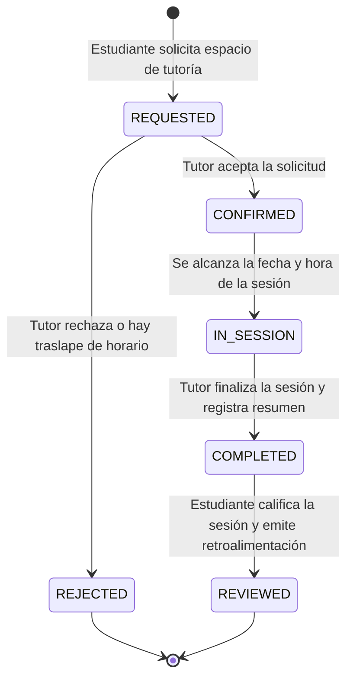

# Especificación del Proyecto Integrador: EduMentor Hub
## Plataforma de Tutorías Académicas entre Pares y Gestión de Tutorías

**Curso:** IF0009 - Desarrollo de Software IV  
**Semestre:** II Ciclo 2026 — Universidad de Costa Rica (UCR, Recinto de Paraíso)  
**Profesor:** Mag. Jonathan Granados C.  
**Modalidad:** Trabajo Colaborativo en Equipos de 4 Estudiantes  
**Duración:** 2.5 Meses (10 Semanas de Desarrollo Activo, Semanas 8 a 18)  
**Ponderación:** 30% de la Nota Final del Curso  

---

## 1. Descripción General del Sistema

**EduMentor Hub** es una plataforma web universitaria orientada a conectar a estudiantes que requieren refuerzo académico con mentores y tutores pares capacitados de niveles superiores. El sistema automatiza la oferta de materias, la configuración de disponibilidad horaria por parte de los tutores, la reserva de sesiones sin traslapes de horario, el intercambio de recursos didácticos y la evaluación del servicio de tutoría.

---

## 2. Dominio del Problema y Flujo de Trabajo

El sistema debe gestionar el flujo operativo de la tutoría académica respetando estrictamente la siguiente máquina de estados finitos:



### Reglas de Negocio Clave:
* **Prevención Determinista de Traslapes:** El backend debe validar que ni el tutor ni el estudiante posean dos sesiones confirmadas en el mismo rango de fecha y hora.
* **Control de Cancelación:** Las sesiones solo pueden cancelarse con al menos 2 horas de anticipación.
* **Sistema de Calificación:** Las evaluaciones de tutoría (1 a 5 estrellas) actualizan automáticamente el promedio acumulado de calificación del tutor.

---

## 3. Modelo de Datos Relacional y Esquema Base

El backend debe implementar al menos las siguientes 6 entidades fundamentales mapeadas mediante Spring Data JPA sobre Microsoft SQL Server:

1. **`Usuario`**: Tabla de seguridad (`id`, `carne`, `email`, `password_hash`, `nombre`, `apellido`, `rol` [`ESTUDIANTE`, `TUTOR`, `COORDINADOR`]).
2. **`Materia`**: Catálogo de asignaturas (`id`, `codigo_materia`, `nombre_materia`, `carrera`, `creditos`).
3. **`DisponibilidadTutor`**: Matriz de horarios (`id`, `tutor_id`, `dia_semana`, `hora_inicio`, `hora_fin`, `esta_activo`).
4. **`SesionTutoria`**: Registro de la tutoría (`id`, `estudiante_id`, `tutor_id`, `materia_id`, `fecha_hora`, `duracion_minutos`, `estado` [`REQUESTED`, `CONFIRMED`, `REJECTED`, `IN_SESSION`, `COMPLETED`, `REVIEWED`], `modalidad` [`VIRTUAL`, `PRESENCIAL`]).
5. **`RecursoEstudio`**: Materiales compartidos (`id`, `sesion_id`, `titulo`, `url_recurso`, `tipo_archivo`).
6. **`EvaluacionTutoria`**: Retroalimentación post-sesión (`id`, `sesion_id`, `calificacion_estrellas` [1-5], `comentario`, `fecha_evaluacion`).

---

## 4. Distribución de Responsabilidades en el Equipo (Grupos of 4)

Para garantizar que **todo estudiante participe en todas las capas del desarrollo full-stack**, se aplica el modelo de **Propiedad Vertical por Funcionalidad (Feature-Based Ownership)**:

```
┌────────────────────────────────────────────────────────────────────────────────────────┐
│                   DISTRIBUCIÓN DE MÓDULOS VERTICALES POR ESTUDIANTE                    │
├─────────────┬───────────────────────────┬──────────────────────────────────────────────┤
│ Estudiante  │ Módulo Vertical Asignado  │ Responsabilidad Full-Stack                   │
├─────────────┼───────────────────────────┼──────────────────────────────────────────────┤
│ Estudiante A│ Módulo de Autenticación y │ Security JWT, User Details, Angular Auth UI, │
│             │ Perfiles de Usuario       │ Interceptores, Formulario Accesible Login.   │
├─────────────┼───────────────────────────┼──────────────────────────────────────────────┤
│ Estudiante B│ Módulo de Materias y      │ DisponibilidadTutor Entity, Algoritmo de     │
│             │ Disponibilidad de Tutor   │ Traslapes, Matriz de Horarios CSS Grid.      │
├─────────────┼───────────────────────────┼──────────────────────────────────────────────┤
│ Estudiante C│ Módulo de Reserva y       │ SesionTutoria State Machine, Endpoints REST, │
│             │ Máquina de Estados        │ Componente Angular con Notificación RxJS.    │
├─────────────┼───────────────────────────┼──────────────────────────────────────────────┤
│ Estudiante D│ Módulo de Recursos,       │ RecursoEstudio & Evaluacion Entities, Star   │
│             │ Calificaciones e i18n     │ Rating Component Angular, Traductores (ES/EN).│
└─────────────┴───────────────────────────┴──────────────────────────────────────────────┘
```

---

## 5. Gobernanza de Repositorios y Git

Los equipos deben estructurar su desarrollo en **dos repositorios separados en GitHub**:

* **Backend Repository:** `dsw4-2026-equipoXX-edumentor-backend` (Java 21, Spring Boot 3, SQL Server).
* **Frontend Repository:** `dsw4-2026-equipoXX-edumentor-frontend` (Angular SPA, RxJS, CSS3, i18n).

### Políticas Obligatorias de Git:
1. **Prohibición de Commits Directos en `main`:** Todo desarrollo se realiza en ramas de funcionalidad (`feature/auth-jwt`, `feature/schedule-matrix`, `feature/booking-state`).
2. **Revisión de Código por Pares (Peer Reviews):** Todo Pull Request (PR) hacia `main` requiere al menos **1 aprobación explícita de un compañero de equipo**.
3. **Auditoría de PRs:** El historial de revisiones y comentarios en GitHub será auditado en cada entrega de Sprint con el profesor.

---

## 6. Desglose de Evaluación y Fases del Proyecto (30% Nota Final)

```
┌────────────────────────────────────────────────────────────────────────────────────────┐
│                              DESGLOSE DE PONDERACIÓN TOTAL                             │
├────────────────────────────────┬────────────┬──────────────────────────────────────────┤
│ Fase                           │ Porcentaje │ Entregables Clave                        │
├────────────────────────────────┼────────────┼──────────────────────────────────────────┤
│ Fase 1: Arquitectura y Diseño  │   35 %     │ Paquete Completo de Diseño UML, ERD,     │
│ (Sprint 0 — Semanas 8-9)       │            │ Especificación OpenAPI 3.0 y Wireframes. │
├────────────────────────────────┼────────────┼──────────────────────────────────────────┤
│ Fase 2: Desarrollo Pseudo-Scrum│   50 %     │ 5 Entregas Bisemanales con Demos, Git    │
│ (Sprints 1 a 5 — Semanas 9-16) │            │ Board y Pull Requests aprobados.         │
├────────────────────────────────┼────────────┼──────────────────────────────────────────┤
│ Fase 3: Defensa Oral en Vivo   │   15 %     │ Modificación de código en tiempo real y  │
│ (Semana 18)                    │            │ defensa técnica individual con docente.  │
└────────────────────────────────┴────────────┴──────────────────────────────────────────┘
```

### 📐 Detalles de la Fase 1: Paquete de Diseño y Arquitectura (35%)
El equipo debe entregar y recibir la aprobación de los siguientes artefactos documentales antes de avanzar en la codificación masiva:

* **1. Modelo Entidad-Relación (ERD):** Diagrama completo con PKs, FKs, tipos de datos SQL Server, restricciones de unicidad y campos de auditoría.
* **2. Diagramas UML Formales:**
  * **Diagrama de Clases UML:** Modelado detallado del backend (Entidades, DTOs, Repositorios, Servicios, Controladores).
  * **Diagrama de Máquina de Estados UML:** Transiciones del estado de la tutoría.
  * **Diagramas de Secuencia UML (Mínimo 2):** Flujo de Autenticación JWT y Flujo de Reserva de Tutoría con Verificación de Traslapes.
* **3. Especificación OpenAPI 3.0 (`openapi.yaml`):** Definición rigurosa de todos los endpoints REST, DTOs de entrada/salida, códigos HTTP y contratos de error bajo RFC 7807 (`ProblemDetails`).
* **4. Diagrama C4 Model:** Niveles 1 (Contexto del Sistema) y 2 (Contenedores: Angular, Spring Boot, SQL Server, Nginx).
* **5. Wireframes UI con Anotaciones WCAG 2.1 AA:** Diseños de pantalla (Mobile y Desktop) indicando la ruta de foco de teclado (`Tab order`) en el calendario de horarios y etiquetas ARIA.

---

## 7. Cronograma de Sprints (Pseudo-Scrum)

```
  Sprint 0 (Sem 8-9)  : Entrega de Paquete de Diseño y Arquitectura UML (35%).
  Sprint 1 (Sem 9-10) : Configuración de DB, Entities JPA, Spring Security JWT y Login Angular.
  Sprint 2 (Sem 11-12): Controllers REST, RFC 7807, Algoritmo de Traslapes y Pruebas Unitarias.
  Sprint 3 (Sem 13-14): Angular Routing, CanActivate Guards, HTTP Interceptors y Matriz de Horarios.
  Sprint 4 (Sem 15)   : Reserva de Sesión con RxJS (notificaciones en tiempo real), i18n (ES/EN) y Reseñas.
  Sprint 5 (Sem 16)   : Auditoría de Accesibilidad WCAG 2.1 AA (Lighthouse ≥ 90), Docker Compose & Nginx.
  Semana 18           : Defensa Oral Final y Modificación de Código en Vivo (15%).
```

---

## 8. Criterios de Aceptación Técnica Básica

* **Backend Spring Boot 3:** Sin problemas de consultas N+1 en relaciones JPA (`JOIN FETCH`). Manejo centralizado de excepciones con `@RestControllerAdvice`.
* **Seguridad:** Tokens JWT firmados, expiración adecuada, listas negras para revocado y RBAC habilitado con `@PreAuthorize`.
* **Frontend Angular:** Arquitectura modular/standalone, manejo de estado reactivo con RxJS (`BehaviorSubject`), validaciones reactivas en formularios.
* **Accesibilidad:** Calificación mínima en Google Lighthouse de **90 en Accesibilidad**. Soporte completo para lectores de pantalla y navegación únicamente con teclado.
* **Internacionalización:** Cambio dinámico de idioma (Español / Inglés) sin reiniciar la aplicación.
