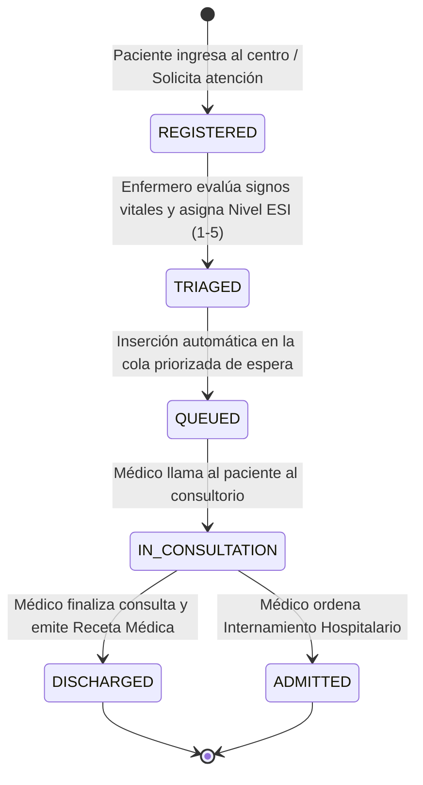

# Especificación del Proyecto Integrador: MedTriage 360
## Sistema de Triaje de Emergencias y Consultas Telemédicas

**Curso:** IF0009 - Desarrollo de Software IV  
**Semestre:** II Ciclo 2026 — Universidad de Costa Rica (UCR, Recinto de Paraíso)  
**Profesor:** Mag. Jonathan Granados C.  
**Modalidad:** Trabajo Colaborativo en Equipos de 4 Estudiantes  
**Duración:** 2.5 Meses (10 Semanas de Desarrollo Activo, Semanas 8 a 18)  
**Ponderación:** 30% de la Nota Final del Curso  

---

## 1. Descripción General del Sistema

**MedTriage 360** es una plataforma web orientada al sector salud que automatiza el proceso de atención en departamentos de urgencias hospitalarias y servicios de telemedicina. El sistema gestiona el flujo completo del paciente: desde su llegada y registro, la evaluación de triaje (asignación de nivel de gravedad ESI 1 a 5 por parte del personal de enfermería), la cola de espera reactiva en tiempo real, la atención médica y la emisión de recetas digitales u órdenes de hospitalización.

---

## 2. Dominio del Problema y Flujo de Trabajo

El sistema debe modelar estrictamente el ciclo de vida del paciente y la atención médica mediante la siguiente máquina de estados finitos:



### Definición de Niveles de Triaje (Escala ESI - Emergency Severity Index):
* **ESI 1 (Rojo - Resucitación):** Atención inmediata por riesgo vital inminente.
* **ESI 2 (Naranja - Emergencia):** Situación de alto riesgo o alteración aguda.
* **ESI 3 (Amarillo - Urgencia):** Requiere múltiples recursos diagnósticos; estable.
* **ESI 4 (Verde - Menor):** Requiere un solo recurso diagnóstico.
* **ESI 5 (Azul - No Urgente):** No requiere recursos diagnósticos adicionales.

---

## 3. Modelo de Datos Relacional y Esquema Base

El backend debe implementar al menos las siguientes 6 entidades fundamentales mapeadas mediante Spring Data JPA sobre Microsoft SQL Server:

1. **`Usuario`**: Tabla de seguridad (`id`, `email`, `password_hash`, `nombre`, `apellido`, `rol` [`PATIENTE`, `ENFERMERO`, `MEDICO`, `ADMIN`]).
2. **`Paciente`**: Expediente básico (`id`, `usuario_id`, `tipo_sangre`, `alergias`, `contacto_emergencia`, `fecha_nacimiento`).
3. **`RegistroTriaje`**: Evaluación de signos vitales (`id`, `paciente_id`, `enfermero_id`, `presion_arterial`, `frecuencia_cardiaca`, `saturacion_oxigeno`, `temperatura`, `nivel_esi` [1-5], `motivo_consulta`, `fecha_registro`).
4. **`ConsultaMedica`**: Gestión de la consulta (`id`, `triaje_id`, `medico_id`, `diagnostico`, `estado` [`REGISTERED`, `TRIAGED`, `QUEUED`, `IN_CONSULTATION`, `DISCHARGED`, `ADMITTED`], `fecha_inicio`, `fecha_fin`).
5. **`RecetaMedica`**: Prescripción digital (`id`, `consulta_id`, `medicamento`, `dosis`, `frecuencia`, `dias_tratamiento`, `indicaciones`).
6. **`BitacoraEstado`**: Registro de auditoría transaccional (`id`, `consulta_id`, `estado_anterior`, `estado_nuevo`, `cambiado_por_usuario_id`, `timestamp`).

---

## 4. Distribución de Responsabilidades en el Equipo (Grupos de 4)

Para garantizar que **todo estudiante participe en todas las capas del desarrollo full-stack**, se utiliza el modelo de **Propiedad Vertical por Funcionalidad (Feature-Based Ownership)**. Cada estudiante liderará un módulo end-to-end (Base de datos, Backend, Angular y Accesibilidad):

```
┌────────────────────────────────────────────────────────────────────────────────────────┐
│                   DISTRIBUCIÓN DE MÓDULOS VERTICALES POR ESTUDIANTE                    │
├─────────────┬───────────────────────────┬──────────────────────────────────────────────┤
│ Estudiante  │ Módulo Vertical Asignado  │ Responsabilidad Full-Stack                   │
├─────────────┼───────────────────────────┼──────────────────────────────────────────────┤
│ Estudiante A│ Módulo de Autenticación y │ Security JWT, User Details, Angular Auth UI, │
│             │ Gestión de Usuarios       │ Interceptores, Formulario Accesible de Login.│
├─────────────┼───────────────────────────┼──────────────────────────────────────────────┤
│ Estudiante B│ Módulo de Registro y      │ RegistroTriaje Entity, Carga de Vitales,     │
│             │ Evaluación de Triaje      │ Formulario Angular con Validación, A11y ESI. │
├─────────────┼───────────────────────────┼──────────────────────────────────────────────┤
│ Estudiante C│ Módulo de Cola Priorizada │ Algoritmo JPQL de Cola, Controller Médico,   │
│             │ y Consulta Médica         │ Dashboard Reactivo Angular con RxJS polling. │
├─────────────┼───────────────────────────┼──────────────────────────────────────────────┤
│ Estudiante D│ Módulo de Recetas,        │ RecetaMedica Entity, PDF Export, Bitácora,   │
│             │ Auditoría e i18n          │ Sistema de Traductores i18n (ES/EN) Angular. │
└─────────────┴───────────────────────────┴──────────────────────────────────────────────┘
```

---

## 5. Gobernanza de Repositorios y Git

Los equipos deben estructurar su desarrollo en **dos repositorios separados en GitHub**:

* **Backend Repository:** `dsw4-2026-equipoXX-medtriage-backend` (Java 21, Spring Boot 3, SQL Server).
* **Frontend Repository:** `dsw4-2026-equipoXX-medtriage-frontend` (Angular SPA, RxJS, CSS3, i18n).

### Políticas Obligatorias de Git:
1. **Prohibición de Commits Directos en `main`:** Todo desarrollo se realiza en ramas de funcionalidad (`feature/auth-jwt`, `feature/triaje-form`, `feature/cola-rxjs`).
2. **Revisión de Código por Pares (Peer Reviews):** Todo Pull Request (PR) hacia `main` requiere al menos **1 aprobación explícita de un compañero de equipo**.
3. **Auditoría de PRs:** El historial de revisiones y comentarios en GitHub será auditado en cada entrega de Sprint con el profesor.

---

## 6. Desglose de Evaluación y Fases del Proyecto (30% Nota Final)

```
┌────────────────────────────────────────────────────────────────────────────────────────┐
│                              DESGLOSE DE PONDERACIÓN TOTAL                             │
├────────────────────────────────┬────────────┬──────────────────────────────────────────┤
│ Fase                           │ Porcentaje │ Entregables Clave                        │
├────────────────────────────────┼────────────┼──────────────────────────────────────────┤
│ Fase 1: Arquitectura y Diseño  │   35 %     │ Paquete Completo de Diseño UML, ERD,     │
│ (Sprint 0 — Semanas 8-9)       │            │ Especificación OpenAPI 3.0 y Wireframes. │
├────────────────────────────────┼────────────┼──────────────────────────────────────────┤
│ Fase 2: Desarrollo Pseudo-Scrum│   50 %     │ 5 Entregas Bisemanales con Demos, Git    │
│ (Sprints 1 a 5 — Semanas 9-16) │            │ Board y Pull Requests aprobados.         │
├────────────────────────────────┼────────────┼──────────────────────────────────────────┤
│ Fase 3: Defensa Oral en Vivo   │   15 %     │ Modificación de código en tiempo real y  │
│ (Semana 18)                    │            │ defensa técnica individual con docente.  │
└────────────────────────────────┴────────────┴──────────────────────────────────────────┘
```

### 📐 Detalles de la Fase 1: Paquete de Diseño y Arquitectura (35%)
El equipo debe entregar y recibir la aprobación de los siguientes artefactos documentales antes de avanzar en la codificación masiva:

* **1. Modelo Entidad-Relación (ERD):** Diagrama completo con PKs, FKs, tipos de datos SQL Server, restricciones de unicidad y campos de auditoría.
* **2. Diagramas UML Formales:**
  * **Diagrama de Clases UML:** Modelado detallado del backend (Entidades, DTOs, Repositorios, Servicios, Controladores).
  * **Diagrama de Máquina de Estados UML:** Transiciones del estado del paciente en la consulta.
  * **Diagramas de Secuencia UML (Mínimo 2):** Flujo de Autenticación JWT y Flujo de Atención de Triaje a Consulta.
* **3. Especificación OpenAPI 3.0 (`openapi.yaml`):** Definición rigurosa de todos los endpoints REST, DTOs de entrada/salida, códigos HTTP y contratos de error bajo RFC 7807 (`ProblemDetails`).
* **4. Diagrama C4 Model:** Niveles 1 (Contexto del Sistema) y 2 (Contenedores: Angular, Spring Boot, SQL Server, Nginx).
* **5. Wireframes UI con Anotaciones WCAG 2.1 AA:** Diseños de pantalla (Mobile y Desktop) indicando la ruta de foco de teclado (`Tab order`), contrastes de color para niveles ESI y etiquetas ARIA.

---

## 7. Cronograma de Sprints (Pseudo-Scrum)

```
  Sprint 0 (Sem 8-9)  : Entrega de Paquete de Diseño y Arquitectura UML (35%).
  Sprint 1 (Sem 9-10) : Configuración de DB, Entities JPA, Spring Security JWT y Login Angular.
  Sprint 2 (Sem 11-12): Controllers REST, RFC 7807, Validaciones de Triaje y Pruebas Unitarias JUnit/Mockito.
  Sprint 3 (Sem 13-14): Angular Routing, CanActivate Guards, HTTP Interceptors y Formulario de Triaje.
  Sprint 4 (Sem 15)   : Dashboard de Cola Priorizada con RxJS (polling/SSE), i18n (ES/EN) y Prescripciones.
  Sprint 5 (Sem 16)   : Auditoría de Accesibilidad WCAG 2.1 AA (Lighthouse ≥ 90), Docker Compose & Nginx.
  Semana 18           : Defensa Oral Final y Modificación de Código en Vivo (15%).
```

---

## 8. Criterios de Aceptación Técnica Básica

* **Backend Spring Boot 3:** Sin problemas de consultas N+1 en relaciones JPA (`JOIN FETCH`). Manejo centralizado de excepciones con `@RestControllerAdvice`.
* **Seguridad:** Tokens JWT firmados, expiración adecuada, listas negras para revocado y RBAC habilitado con `@PreAuthorize`.
* **Frontend Angular:** Arquitectura modular/standalone, manejo de estado reactivo con RxJS (`BehaviorSubject`), validaciones reactivas en formularios.
* **Accesibilidad:** Calificación mínima en Google Lighthouse de **90 en Accesibilidad**. Soporte completo para lectores de pantalla y navegación únicamente con teclado.
* **Internacionalización:** Cambio dinámico de idioma (Español / Inglés) sin reiniciar la aplicación.
