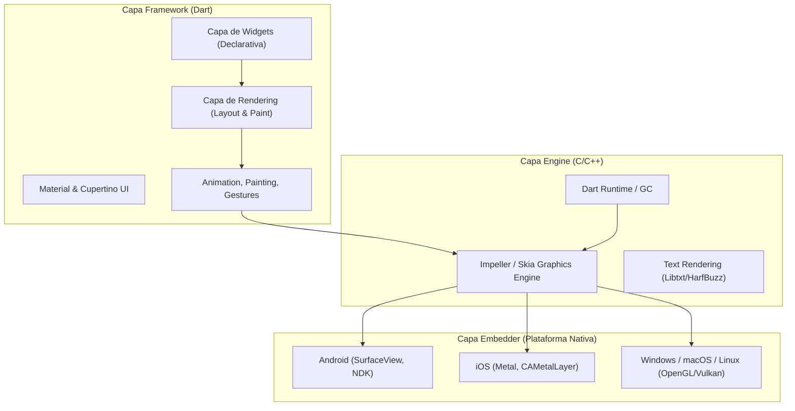
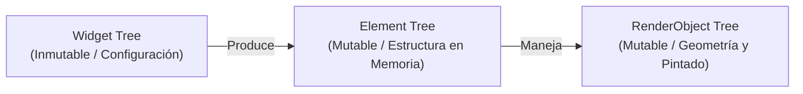
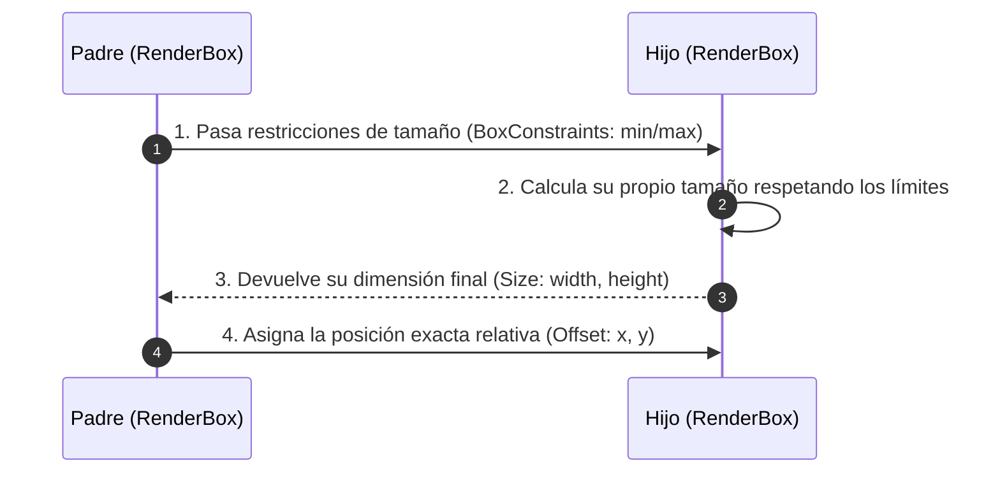
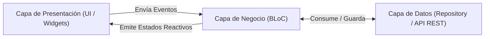

**UNIVERSIDAD DE COSTA RICA**  
**SEDE DEL ATLÁNTICO - RECINTO PARAÍSO**  
**CARRERA DE INFORMÁTICA EMPRESARIAL**  
**CURSO:** IF0009 - Desarrollo de Software IV  
**PROFESOR:** Mag. Jonathan Granados C.  
**SEMESTRE:** II-2026  

---

# Tema 5.2.1: Repaso Profundo de Flutter & Dart 3 (Arquitectura Interna, Ciclo de Vida y Gestión de Estado Avanzada)

> [!NOTE]
> Este documento representa la lectura teórica fundamental e investigativa del **Subtema 5.2.1**. Explora a nivel de ingeniería interna el motor gráfico de Flutter, la arquitectura de los tres árboles de renderizado, las capacidades modernas de Dart 3, el ciclo de vida riguroso de los widgets y la comparación de arquitecturas avanzadas de estado en proyectos móviles empresariales.

---

## 1. Arquitectura Interna del Framework Flutter

A diferencia de los enfoques multiplataforma basados en puentes de serialización JSON en tiempo de ejecución (como React Native tradicional) o los enfoques basados en WebViews (como Ionic), **Flutter compila a código de máquina nativo (AOT - Ahead-Of-Time)** y controla cada píxel renderizado en pantalla dibujando directamente mediante un motor gráfico acelerado por GPU.



### 1.1 El Motor Gráfico: Skia vs. Impeller

* **Skia:** Históricamente el motor gráfico 2D por defecto. Convierte llamadas de dibujado en comandos OpenGL/Vulkan/Metal. Sin embargo, puede presentar pequeñas interrupciones visuales (*jank*) por compilación tardía de shaders durante la ejecución inicial (*Shader Compilation Jank*).
* **Impeller:** El motor gráfico de nueva generación desarrollado por Google específicamente para Flutter. Precompila un conjunto estricto y optimizado de shaders durante la fase de construcción de la aplicación (*Build Time*), garantizando una tasa de refresco constante de **60 a 120 FPS** sin caídas de cuadros (*frame drops*).

---

### 1.2 La Arquitectura de los Tres Árboles (The Three-Tree Architecture)

Para lograr un rendimiento óptimo en la reconstrucción de interfaces declarativas, Flutter mantiene **tres árboles paralelos** sincronizados en memoria:



#### 1. Widget Tree (Árbol de Widgets)
* Es una representación declarativa e **inmutable** de la configuración visual.
* Es sumamente liviano en memoria; crearse y destruirse constantemente en cada cuadro no genera impacto apreciable en el recolector de basura (*Garbage Collector*).

#### 2. Element Tree (Árbol de Elementos)
* Representa la estructura **mutable** persistente de la aplicación en memoria.
* Actúa como el puente o middleware entre el Widget (configuración) y el RenderObject (píxeles).
* Conserva el estado de los `StatefulWidget` mediante la propiedad `state`.

#### 3. RenderObject Tree (Árbol de Objetos de Renderizado)
* Es el árbol responsable de calcular las coordenadas geométricas, el tamaño (`size`) y ejecutar las operaciones físicas de pintado en la GPU.
* Aplica el algoritmo de **Layout en una sola pasada (Single-Pass Layout)** mediante el principio:

> **"Constraints Go Down. Sizes Go Up. Parent Sets Position."**  
> *(Las restricciones bajan. Los tamaños suben. El padre posiciona).*



---

## 2. El Lenguaje Dart 3: Características Avanzadas

Flutter utiliza **Dart 3**, un lenguaje moderno fuertemente tipado que soporta tanto compilación **JIT (Just-In-Time)** durante el desarrollo para permitir el reinicio en caliente (*Hot Reload*), como compilación **AOT (Ahead-Of-Time)** para entornos de producción.

### 2.1 Sound Null Safety y Promoción de Tipos

Dart garantiza que los errores de referencia nula (*NullPointerExceptions*) sean detectados en tiempo de compilación.

```dart
// Variable no nula obligatoria
String nombreUsuario = 'Elena Madrigal';

// Variable anulable opcional
String? telefonoContacto;

void procesarContacto(String? contacto) {
  if (contacto != null) {
    // Promoción de tipo automática: dentro del bloque es String no nulo
    print('Teléfono: ${contacto.toUpperCase()}');
  }
}
```

### 2.2 Patrones, Registros (Records) y Class Modifiers

Dart 3 introduce tuplas tipadas sin necesidad de clases adicionales y *pattern matching* exhaustivo.

```dart
// Retorno múltiple mediante Registros (Records)
(int statusCode, String message) consultarEstadoServicio() {
  return (200, 'Operación exitosa');
}

void procesarRespuesta() {
  final (code, msg) = consultarEstadoServicio();
  print('Respuesta HTTP: $code - $msg');
}

// Jerarquías selladas (Sealed Classes) y Pattern Matching
sealed class EstadoCita {}
class CitaPendiente extends EstadoCita {}
class CitaAtendida extends EstadoCita { final String receta; CitaAtendida(this.receta); }
class CitaCancelada extends EstadoCita { final String motivo; CitaCancelada(this.motivo); }

String evaluarEstado(EstadoCita estado) {
  // El compilador exige cubrir todos los casos (Exhaustiveness Check)
  return switch (estado) {
    CitaPendiente() => 'La cita está en espera de atención',
    CitaAtendida(receta: final r) => 'Atendida. Receta: $r',
    CitaCancelada(motivo: final m) => 'Cancelada por: $m',
  };
}
```

---

## 3. Ciclo de Vida del Widget y del Estado en Flutter

Los dos bloques constructivos fundamentales son `StatelessWidget` (sin estado mutable interno) y `StatefulWidget` (asociado a una instancia persistente de `State<T>`).

### 3.1 Diagrama del Ciclo de Vida de un `StatefulWidget`

```mermaid
graph TD
    A["1. Constructor Widget"] --> B["2. createState()"]
    B --> C["3. initState()"]
    C --> D["4. didChangeDependencies()"]
    D --> E["5. build() (Renderizado)"]
    E -->|setState() invocado| E
    E -->|Widget Padre se actualiza| F["didUpdateWidget()"]
    F --> E
    E -->|Removido temporalmente| G["deactivate()"]
    G -->|Destruido permanentemente| H["dispose()"]
```

### 3.2 Explicación Detallada de los Métodos del Ciclo de Vida

```dart
import 'package:flutter/material.dart';

class MonitorMedicoWidget extends StatefulWidget {
  final String pacienteId;

  const MonitorMedicoWidget({
    super.key, 
    required this.pacienteId,
  });

  @override
  State<MonitorMedicoWidget> createState() => _MonitorMedicoWidgetState();
}

class _MonitorMedicoWidgetState extends State<MonitorMedicoWidget> 
    with WidgetsBindingObserver {
  
  int _frecuenciaCardiaca = 75;

  @override
  void initState() {
    super.initState();
    // Invocado UNA SOLA VEZ cuando el estado se inserta en el árbol.
    // Ideal para suscripciones, inicializar streams o timers.
    WidgetsBinding.instance.addObserver(this);
    print('1. initState: Inicializando sensores para ${widget.pacienteId}');
  }

  @override
  void didChangeDependencies() {
    super.didChangeDependencies();
    // Invocado inmediatamente después de initState() o cuando un
    // InheritedWidget del cual se depende cambia de valor (ej. Theme, Locale).
    print('2. didChangeDependencies: Actualizando dependencias de contexto');
  }

  @override
  void didUpdateWidget(covariant MonitorMedicoWidget oldWidget) {
    super.didUpdateWidget(oldWidget);
    // Invocado si el widget padre se reconstruye y pasa nuevas propiedades.
    if (oldWidget.pacienteId != widget.pacienteId) {
      print('3. didUpdateWidget: El ID del paciente cambió');
    }
  }

  @override
  void didChangeAppLifecycleState(AppLifecycleState state) {
    // Intercepta eventos del sistema operativo (Resumed, Paused, Detached)
    if (state == AppLifecycleState.paused) {
      print('App en segundo plano: Pausando lectura de sensores');
    }
  }

  @override
  Widget build(BuildContext context) {
    // Reconstruye la interfaz gráfica declarativa. Debe ser un método puro.
    return Scaffold(
      appBar: AppBar(title: Text('Paciente: ${widget.pacienteId}')),
      body: Center(
        child: Column(
          mainAxisAlignment: MainAxisAlignment.center,
          children: [
            Text('Frecuencia Cardíaca: $_frecuenciaCardiaca BPM'),
            ElevatedButton(
              onPressed: () {
                setState(() {
                  _frecuenciaCardiaca += 5;
                });
              },
              child: const Text('Simular Pulso'),
            )
          ],
        ),
      ),
    );
  }

  @override
  void deactivate() {
    // Invocado cuando el estado es removido del árbol pero puede volver a insertarse.
    print('4. deactivate: Removiendo temporalmente');
    super.deactivate();
  }

  @override
  void dispose() {
    // Invocado cuando el estado se destruye permanentemente.
    // OBLIGATORIO: Cancelar timers, controllers, streams y observers para evitar Memory Leaks.
    WidgetsBinding.instance.removeObserver(this);
    print('5. dispose: Liberando recursos en memoria');
    super.dispose();
  }
}
```

---

## 4. Paradigmas de Gestión de Estado (State Management)

En aplicaciones profesionales no se recomienda el uso masivo de `setState()` para estados globales o compartidos, ya que acopla la lógica de negocio a la interfaz y provoca reconstrucciones innecesarias del árbol de widgets.

### 4.1 Cuadro Comparativo de Arquitecturas de Estado

| Arquitectura | Mecanismo Interno | Complejidad | Caso de Uso Recomendado |
|---|---|:---:|---|
| **InheritedWidget** | Integrado en el Element Tree | Media | Propagación descendente de configuraciones globales (Temas, Idioma). |
| **Provider / ChangeNotifier** | Listener / Observer Pattern | Baja | Aplicaciones pequeñas a medianas, prototipos rápidos. |
| **BLoC / Cubit** | Reactive Streams (`rxdart` / `async*`) | Alta | Aplicaciones empresariales complejas, arquitectura desacoplada y auditable. |
| **Riverpod** | Reactividad Funcional Compile-Safe | Media-Alta | Proyectos escalables que requieren inyección segura e independencia del BuildContext. |

---

### 4.2 Patrón BLoC (Business Logic Component)

El patrón **BLoC** separa estrictamente la capa de UI de la lógica de negocio utilizando entrada de eventos (*Events*) y salida de estados (*States*).



#### Ejemplo Completo con BLoC / Cubit:

```dart
// 1. Definiendo el Estado
abstract class TriajeState {}
class TriajeInicial extends TriajeState {}
class TriajeCargando extends TriajeState {}
class TriajeExitoso extends TriajeState {
  final List<String> pacientesEnEspera;
  TriajeExitoso(this.pacientesEnEspera);
}

// 2. Definiendo el Cubit / BLoC
class TriajeCubit extends Cubit<TriajeState> {
  TriajeCubit() : super(TriajeInicial());

  Future<void> cargarPacientes() async {
    emit(TriajeCargando());
    await Future.delayed(const Duration(seconds: 2)); // Simulación API
    emit(TriajeExitoso(['Elena Madrigal', 'Mario Jiménez']));
  }
}

// 3. Consumo en la UI mediante BlocBuilder
class VistaTriaje extends StatelessWidget {
  const VistaTriaje({super.key});

  @override
  Widget build(BuildContext context) {
    return BlocProvider(
      create: (_) => TriajeCubit()..cargarPacientes(),
      child: Scaffold(
        appBar: AppBar(title: const Text('Consola de Triaje')),
        body: BlocBuilder<TriajeCubit, TriajeState>(
          builder: (context, state) {
            return switch (state) {
              TriajeInicial() || TriajeCargando() => 
                const Center(child: CircularProgressIndicator()),
              TriajeExitoso(pacientes: final lista) => 
                ListView.builder(
                  itemCount: lista.length,
                  itemBuilder: (_, index) => ListTile(
                    title: Text(lista[index]),
                    leading: const Icon(Icons.person),
                  ),
                ),
              _ => const Center(child: Text('Estado no reconocido')),
            };
          },
        ),
      ),
    );
  }
}
```

---

## 5. Técnicas de Optimización y Buenas Prácticas de Rendimiento

Para garantizar un rendimiento fluido constante de 60/120 FPS en aplicaciones móviles Flutter, aplique las siguientes directrices:

1. **Uso Estricto de Constructores `const`:**
   * Al declarar widgets como `const`, Flutter reutiliza exactamente la misma instancia del `ElementBox` en memoria, evitando llamar a su método `build()` en futuras re-renderizaciones.

2. **Uso Correcto de Keys (`ValueKey`, `GlobalKey`):**
   * Use `ValueKey` al reordenar elementos en listas dinámicas para evitar que el `Element Tree` asocie estados mutables a widgets incorrectos al cambiar sus posiciones.

3. **Aislamiento de Zonas de Reconstrucción (Sub-trees):**
   * Extraiga widgets complejos o dinámicos en clases independientes (`StatelessWidget` separadas) en lugar de utilizar métodos auxiliares `Widget _buildLista()`. Los métodos dentro de la misma clase fuerzan la reconstrucción de todo el componente contenedor.

4. **Uso de `RepaintBoundary`:**
   * Envuelva animaciones pesadas o lienzos de pintado personalizado (`CustomPaint`) en un `RepaintBoundary` para crear una capa gráfica independiente en el compositor de GPU, evitando re-dibujar la pantalla completa.

---

## 💻 Ejercicio Práctico Evaluado

> [!TIP]
> **Instrucciones para el Estudiante:**
> 1. Modifique el componente `MonitorMedicoWidget` para que implemente un `Timer.periodic` de 1 segundo que incremente la frecuencia cardíaca de forma aleatoria entre 60 y 110 BPM.
> 2. Asegúrese de cancelar el `Timer` de forma limpia dentro del método `dispose()` para evitar fugas de memoria (*Memory Leaks*).
> 3. Verifique los eventos del ciclo de vida pausando la ejecución de la aplicación desde el emulador Android o iOS.
