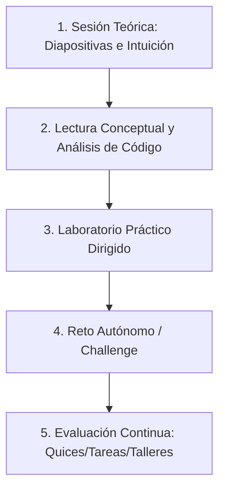

# Guía de Uso Académico y Pedagógico (User Guide)

Esta guía detalla las pautas académicas y metodológicas para impartir de forma exitosa las lecciones del curso **IF0009 - Desarrollo de Software IV (II Ciclo 2026)** en la Universidad de Costa Rica (UCR), Recinto de Paraíso, utilizando los materiales didácticos provistos en este repositorio.

---

## 🎓 Enfoque Metodológico del Curso

El curso de Desarrollo de Software IV es **teórico-práctico** (3 horas de teoría, 5 horas de práctica semanales). La estrategia de enseñanza-aprendizaje recomendada se basa en el **ciclo constructivista de aprendizaje activo**:

1.  **Presentación Conceptual (Sesión Teórica)**: Utilizar las diapositivas interactivas para sentar las bases teóricas, fomentar preguntas de reflexión y debatir trampas arquitectónicas comunes.
2.  **Lectura Dirigida**: Facilitar la lectura detallada de los temas generados. Fomentar que el estudiante lea el material de forma previa a la lección práctica.
3.  **Laboratorios Prácticos (Sesión de Cómputo)**: Desarrollar paso a paso los ejercicios guiados de configuración y codificación, e incentivar al estudiante a resolver de forma individual el desafío final propuesto en cada laboratorio.

---

## 🏫 Pautas de Comunicación y Lenguaje (Guardrail de Calidad)

*   **Formalidad y Respeto**: Todos los contenidos (lecturas, diapositivas, enunciados de retos y evaluaciones) deben formularse en **español formal** utilizando la conjugación del pronombre **"usted"** (ejemplo: *"analice el código"*, *"proponga una solución"*, *"ejecute el servidor"*).
*   **Sin Tutear**: Evite el uso de conjugaciones informales ("tú" o "vos") en las explicaciones para mantener la seriedad del contexto académico universitario.
*   **Terminología Técnica Estándar**: Conserve los términos en inglés comúnmente aceptados por la industria de la computación (ejemplo: *CORS*, *Request/Response*, *Stateless*, *Middleware*, *Full-stack*) acompañados de su explicación conceptual.

---

## 📝 Consolidado del Sistema de Evaluación (Syllabus)

La nota final del curso se calculará aplicando los siguientes porcentajes definidos en la planeación didáctica:

| Instrumento Evaluativo | Cantidad Sugerida | Porcentaje Total | Detalle Académico |
| :--- | :--- | :--- | :--- |
| **Exámenes Teórico-Prácticos** | 2 exámenes | **30%** (15% c/u) | Evalúa conocimientos conceptuales y capacidad de diseño en papel. |
| **Laboratorios** | Varios | **15%** | Prácticas semanales de laboratorio y retos autónomos. |
| **Tareas de Programación** | 2-3 tareas | **15%** | Proyectos medianos de desarrollo full-stack e investigación. |
| **Quices y Trabajo en Clase** | Varios | **10%** | Pruebas cortas formativas y análisis de código/conceptos. |
| **Proyecto del Curso** | 1 proyecto | **30%** | Desarrollo de una aplicación completa e integrada (Back, Front, Base de datos y Seguridad). |

---

## 🖥️ Guía de Presentación de Diapositivas (Reveal.js)

Las presentaciones HTML generadas se ejecutan directamente en cualquier navegador moderno sin necesidad de conexión a internet o servidores complejos.

### Comandos Rápidos del Teclado durante la Clase:
*   **Flechas Derecha / Izquierda (o Espacio)**: Avanzar o retroceder de diapositiva.
*   **Tecla `F`**: Activar el modo de **pantalla completa** (elimina barras de herramientas y menús del navegador).
*   **Tecla `O`**: Mostrar el **modo vista general (Overview)**, útil para ver la cuadrícula completa de diapositivas y saltar rápidamente a un tema en respuesta a una duda de los estudiantes.
*   **Tecla `S`**: Abrir la vista del presentador (muestra notas y temporizador).

### Recomendaciones al Presentar Código:
Las diapositivas incluyen cajas de código con syntax highlighting Tokyo Night. Se recomienda al profesor interactuar con la consola de depuración del navegador (F12) o copiar el código directamente en el IDE de desarrollo durante la explicación en pizarra digital para realizar pruebas en caliente con los alumnos.
